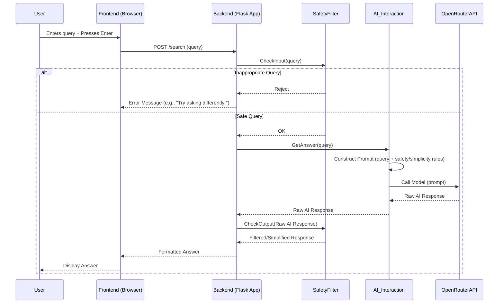

# Project: KidSearch AI

**Goal:** A safe, simple AI search engine for children aged 6-10 using Flask and a generative AI model via OpenRouter.

**1. Core Components:**

*   **Frontend (HTML/CSS/JavaScript):**
    *   A very simple web page with a text input box for the search query.
    *   Submits the query to the backend when the user presses Enter.
    *   Displays the formatted, kid-friendly answer received from the backend.
    *   Minimalist design, large fonts, clear visuals.
*   **Backend (Flask):**
    *   A single API endpoint (e.g., `/search`) to receive POST requests with the user's query.
    *   Orchestrates the processing flow: input safety checks -> AI interaction -> output filtering/simplification -> response.
    *   Manages configuration (like OpenRouter API key).
*   **Safety & Filtering Layer (Python Module):**
    *   **Input Filtering:** Checks the incoming query for blocked keywords, potentially harmful patterns, or negative sentiment (basic analysis). Rejects inappropriate queries immediately.
    *   **Output Filtering:** Analyzes the AI-generated response for any residual unsafe content, overly complex language, or topics flagged as inappropriate, before sending it to the frontend.
*   **AI Interaction Layer (Python Module):**
    *   Constructs the detailed prompt for the OpenRouter API, incorporating the user's query, strict safety instructions, and detailed requirements for simple language (reading level, sentence length, tone, examples, topic restrictions).
    *   Handles the API call to OpenRouter (e.g., `google/gemini-flash-1.5`).
    *   Parses the response from the API.

**2. Essential Libraries & Tools:**

*   **Flask:** Web framework for the backend API.
*   **requests:** Standard Python library for making HTTP requests to the OpenRouter API.
*   **(Optional) Content Filtering Libraries:** Potentially libraries like `profanity-check` or building custom keyword lists/regex for basic filtering. More advanced sentiment analysis could use libraries like `nltk` or `spaCy` if needed, but might be overkill initially.
*   **OpenRouter API Key:** Required for accessing the AI model.

**3. Data Flow:**



**4. Safety & Simplification Mechanisms:**

*   **Input Safety:**
    *   Maintain a blocklist of inappropriate keywords/phrases.
    *   Reject queries containing blocked terms.
    *   (Optional) Basic sentiment check to block overly negative/aggressive queries.
*   **Prompt Engineering (Crucial):**
    *   The prompt sent to the OpenRouter API is key. It must explicitly instruct the model:
        *   "You are a helpful assistant for children aged 6-10."
        *   "Answer the following query: [User Query]"
        *   "Use simple words suitable for a 2nd-grade reading level."
        *   "Keep sentences short (under 12 words on average)."
        *   "Use concrete examples or simple analogies children can understand."
        *   "Maintain a positive, encouraging, and friendly tone."
        *   "DO NOT discuss violence, scary topics, complex adult themes, or anything unsafe for children."
        *   "If the query is inappropriate or asks about forbidden topics, respond with: 'I can't answer that, let's try a different question!'"
        *   "Provide concise answers."
*   **Output Filtering:**
    *   After receiving the response from the AI, perform another check using the keyword blocklist.
    *   (Optional) Check sentence length and potentially use a readability score (e.g., Flesch-Kincaid) if the model struggles with simplicity, although good prompting should minimize this need.
    *   If the output fails checks, return a generic safe message instead.

**5. Project Structure (Example):**

```
kid-search/
├── app.py             # Flask application
├── static/
│   ├── css/
│   │   └── style.css  # Basic styling
│   └── js/
│       └── script.js  # Frontend logic (fetch API)
├── templates/
│   └── index.html     # Main HTML page
├── safety_filter.py   # Input/Output filtering logic
├── ai_interaction.py  # Logic for calling OpenRouter API
├── requirements.txt   # Python dependencies (Flask, requests)
└── .env               # To store API keys (add to .gitignore)